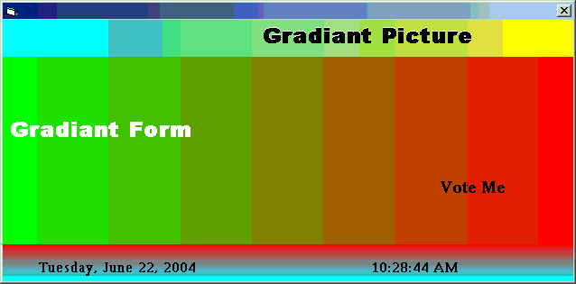



## \[A Gradiant Form and Picture\]

### Description

A simple and easy gradiant example. No additional ActiveX Control. Used many parameters.
 
### More Info
 

             |
---                |---
**Submitted On**   |2004-06-21 23:37:02
**By**             |[Lutfur Rahman Bhuiyan](https://github.com/Planet-Source-Code/PSCIndex/blob/master/ByAuthor/lutfur-rahman-bhuiyan.md)
**Level**          |Beginner
**User Rating**    |4.2 (21 globes from 5 users)
**Compatibility**  |VB 5\.0, VB 6\.0
**Category**       |[Custom Controls/ Forms/  Menus](https://github.com/Planet-Source-Code/PSCIndex/blob/master/ByCategory/custom-controls-forms-menus__1-4.md)
**World**          |[Visual Basic](https://github.com/Planet-Source-Code/PSCIndex/blob/master/ByWorld/visual-basic.md)
**Archive File**   |[\[A\_Gradian1760396212004\.zip](https://github.com/Planet-Source-Code/lutfur-rahman-bhuiyan-a-gradiant-form-and-picture__1-54532/archive/master.zip)

